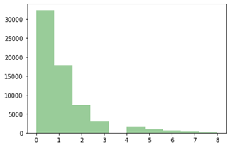
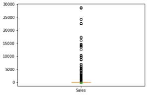
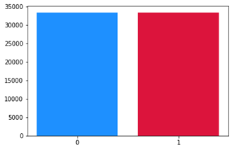

## NFT 최대 마켓 OpenSea 데이터 분석 및 악용사례 분류 기법
 This repository is based on paper <b>NFT Largest Market OpenSea Data Analysis and Abuse Classification Technique</b>

## Abstract

```
 현재 메타버스와 NFT는 제 4차 산업혁명을 이끌 주역으로 손꼽히고 있고 그에 따른 관심도 점점 더 높아지고 있다. 
 하지만 메타버스와 NFT는 신생 사업으로, 대부분의 사람에게 익숙하지 않은 분야이다. 
 그렇기에 이를 악용하여 사기나 사칭, 통정매매 등으로 부당한 이익을 취하는 경우도 생기고 있다. 
 하지만 이를 미리 예방하기도 힘들뿐더러 법적 처벌 또한 어렵다. 
 그렇기에 이 논문에서는 NFT와 메타버스 시장을 분석하고 딥러닝 기법으로 악용사례를 분류해보고자 한다.
```

```
Currently, Metaverse and NFT are considered the leading players in leading the 4th Industrial Revolution, and interest is increasing accordingly. 
However, Metaverse and NFT are very new businesses that most people are not familiar with. 
Therefore, there are cases in which unfair profits are obtained through fraud, impersonation, or sale of a corporation by exploiting this. 
However, it is not only difficult to prevent this in advance, but also difficult to punish. 
Therefore, in this paper, we would like to analyze the NFT and Metaverse markets and classify abuse cases through deep learning.
```

</br>

## Images


<p align="center">
  
  
  
</p>


## References
* Schwab, Klaus. The fourth industrial revolution. Currency, 2017.

* Wang, Qin, et al. "Non-fungible token (NFT): Overview, evaluation, opportunities and challenges." arXiv preprint arXiv:2105.07447 (2021).

* Kemp, Jeremy, and Daniel Livingstone. "Putting a Second Life “metaverse” skin on learning management systems." Proceedings of the Second Life education workshop at the Second Life community convention. Vol. 20. CA, San Francisco: The University of Paisley, 2006.

* Nadini, Matthieu, et al. "Mapping the NFT revolution: market trends, trade networks, and visual features." Scientific reports 11.1 (2021): 1-11.

* Carmigniani, Julie, and Borko Furht. "Augmented reality: an overview." Handbook of augmented reality (2011): 3-46.

* Gurrin, Cathal, Alan F. Smeaton, and Aiden R. Doherty. "Lifelogging: Personal big data." Foundations and trends in information retrieval 8.1 (2014): 1-125.

* Nofer, Michael, et al. "Blockchain." Business & Information Systems Engineering 59.3 (2017): 183-187.

* Falchuk, Ben, Shoshana Loeb, and Ralph Neff. "The social metaverse: Battle for privacy." IEEE Technology and Society Magazine 37.2 (2018): 52-61.

* Pilkington, Marc. "Blockchain technology: principles and applications." Research handbook on digital transformations. Edward Elgar Publishing, 2016.

* von Wachter, Victor, et al. "NFT Wash Trading: Quantifying suspicious behaviour in NFT markets." Financial Cryptography and Data Security. FC 2022 International Workshops. 2021.

* LeCun, Yann, Yoshua Bengio, and Geoffrey Hinton. "Deep learning." nature 521.7553 (2015): 436-444.

* Russom, Philip. "Big data analytics." TDWI best practices report, fourth quarter 19.4 (2011): 1-34.

* Narayanan, Arvind, et al. Bitcoin and cryptocurrency technologies: a comprehensive introduction. Princeton University Press, 2016.

* Pickholz, Marvin G., and Jason Pickholz. "Manipulation." Journal of Financial Crime (2001).

* Singels, Jeroen, Gwenny Ruël, and Henny Van De Water. "ISO 9000 series‐Certification and performance." International Journal of Quality & Reliability Management (2001).

* Cao, Xi Hang, Ivan Stojkovic, and Zoran Obradovic. "A robust data scaling algorithm to improve classification accuracies in biomedical data." BMC bioinformatics 17.1 (2016): 1-10. 

* Danielsson, Per-Erik. "Euclidean distance mapping." Computer Graphics and image processing 14.3 (1980): 227-248. 

* Ng, Andrew. "Sparse autoencoder." CS294A Lecture notes 72.2011 (2011): 1-19.

* Ramchoun, Hassan, et al. "Multilayer perceptron: Architecture optimization and training." (2016).

* Hochreiter, Sepp, and Jürgen Schmidhuber. "Long short-term memory." Neural computation 9.8 (1997): 1735-1780.

* Zaremba, Wojciech, Ilya Sutskever, and Oriol Vinyals. "Recurrent neural network regularization." arXiv preprint arXiv:1409.2329 (2014).

* Chung, Junyoung, et al. "Empirical evaluation of gated recurrent neural networks on sequence modeling." arXiv preprint arXiv:1412.3555 (2014).

* Vaswani, Ashish, et al. "Attention is all you need." Advances in neural information processing systems 30 (2017).
